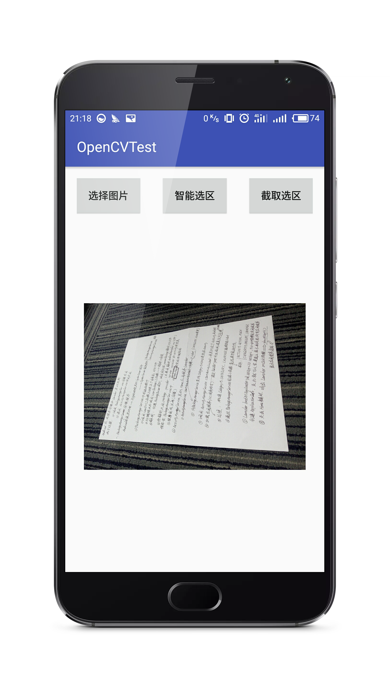

### 人脸检测+智能选区截图

最近在学习OpenCV，随便将两个特别有用的功能封装出来，一个是人脸检测，另一个是智能选区截图（模仿扫描王的功能），就在这里分享给大家，也希望能在某方面给大家提供思路。现在只能下载项目查看 )，以后有时间我再将这两个功能做成依赖库。

## Features

- 手机相机屏幕适配：自动获取当前相机中最适合屏幕显示的分辨率，避免画面拉伸的情况
- 人脸检测：基于OpenCV及其训练模型lbpcascade_frontalface.xml，因为是使用相机动态人脸检测，所以在检测前对图像进行了压缩处理，检测距离略有下降
- 智能选区截图：这里很感谢[pqpo](https://github.com/pqpo/SmartCropper/issues/3)提供了实现思路，目前在实现测试中发现对于近似背景的检测结果并不理想，而且不能识别多个选区，以后将在此基础上继续完善

## Screenshots

#### 人脸检测

#### 智能选区截图

  

## Instructions

- 如果你有任何意见， bug， 问题都可以给我提 Issue， 我会第一时间关注并解决
- 在人脸检测和智能选区方面我后期会继续完善，欢迎大家关注

